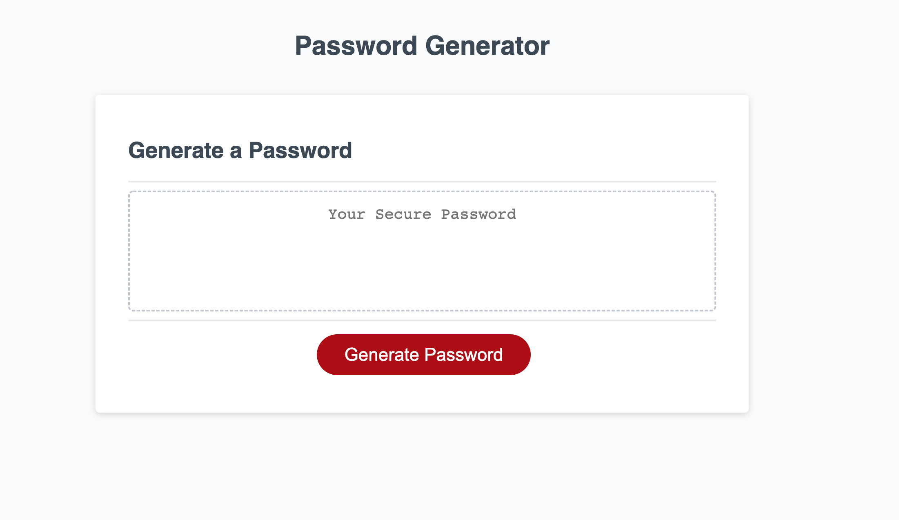

# Password Generator 

# Description

The client frquently has to access sensitive data and would like to ensure high level of security. They would like an application that randomly generates a password based on defined criteria ensuring strong security.

# How To Implement

User will click the button to generate a password

After clicking the user will be prompted with questions regarding a. criteria & b. options for password:

Criteria:
Must be between 8 and 128 characters long
Must choose at least 1 of the character options:
numbers
lower case letter
upper case letter
and/or special character
Options:
User chooses length of PW within the criteria
User can choose which/some/or all of the PW character choices: (must include at least 1 option per criteria above)
numbers
lower case letter
upper case letter
special character
Upon answering the prompts the password will generate and appear in the box.

# Site

https://jkgdev8.github.io/Password-Generator-UCLA-Challenge-3/

